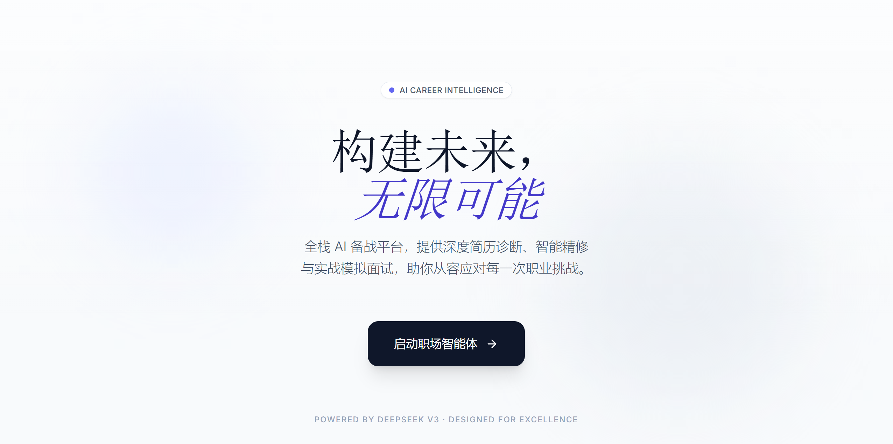

# 智感生涯 (AI Career Intelligence)

> 连接 AI 能力与职场未来的全栈桥梁

[](https://nextjs.org/)
[](https://www.typescriptlang.org/)
[](https://tailwindcss.com/)
[](https://github.com/pmndrs/zustand)
[](https://www.deepseek.com/)




## 项目初衷 (Project Vision)

本项目是一个 Vibe Coding 新手的 7 天实战作品。

在 AI 技术爆发的当下，应届生求职依然面临巨大的信息差与效率瓶颈。智感生涯 (AI Career Intelligence) 旨在打破这一困局，通过全栈技术将大模型能力深度融入简历诊断、内容精修与模拟面试的每一个环节，为求职者提供一套科学、闭环的备战工具。

## 核心功能 (Key Features)

### 全维诊断 (Comprehensive Diagnostic)
打破传统"文本润色"的局限，基于目标 JD (Job Description) 对简历进行深度语义分析。系统生成多维度量化雷达图，直观展示候选人与岗位的匹配度，精准定位竞争力短板。
<video src="https://github.com/user-attachments/assets/90d46092-d6f2-4081-9b58-7784f944cd30" controls="controls" width="100%" style="max-width: 800px;"></video>

### 智感编辑器 (Intelligent Editor)
采用左侧对话式交互、右侧实时 A4 预览的分栏设计。支持通过自然语言指令实时修改简历内容，配合 Markdown 实时渲染引擎，实现"所见即所得"的极致编辑体验。
<video src="https://github.com/user-attachments/assets/6ae745dc-9753-4899-ab14-58112a81099c" controls="controls" width="100%" style="max-width: 800px;"></video>

### 多 Agent 模拟面试 (Multi-Agent Interview)
构建了包含 HR、技术负责人、业务总监等不同角色的 Agent 矩阵。模拟真实的职场面试压力与追问逻辑，提供沉浸式的实战演练环境，并生成包含评分与改进建议的详细复盘报告。
<video src="https://github.com/user-attachments/assets/e3df23b6-a74d-49d8-a5fb-b1cf22e92aed" controls="controls" width="100%" style="max-width: 800px;"></video>

## 硬核技术挑战 (Technical Highlights)

### 安全架构 (Security Architecture)
基于 Next.js 14 App Router 构建了完备的 Serverless API 转发逻辑。所有的 DeepSeek API 调用均在服务端完成，确保敏感的 `API_KEY` 实现物理隔离，彻底杜绝客户端泄露风险。

### 复杂状态管理 (Complex State Management)
针对编辑器、聊天窗口、预览区三方数据联动的挑战，采用了 React 状态提升与单向数据流架构。利用 Zustand 建立全局单一数据源，确保了高频交互场景下的数据一致性与 UI 渲染性能。

### 高性能解析 (High-Performance Parsing)
摒弃了不稳定的前端解析方案，实现了基于后端流式处理的 PDF 解析服务。通过处理二进制流并结合结构化提取算法，即使是复杂的排版布局也能确保数据的精准提取。

## 技术栈 (Tech Stack)

*   **Framework**: Next.js 14 (App Router)
*   **Language**: TypeScript
*   **Styling**: Tailwind CSS, Typography Plugin
*   **State Management**: Zustand
*   **AI Integration**: DeepSeek V3 API
*   **Visualization**: Chart.js
*   **PDF Processing**: pdf2json (Server-side)

## 快速启动 (Quick Start)

### 1. 克隆项目
```bash
git clone https://github.com/your-username/ai-career-agent.git
cd ai-career-agent
```

### 2. 安装依赖
```bash
npm install
```

### 3. 环境配置
复制环境变量示例文件：
```bash
cp .env.example .env.local
```
在 `.env.local` 中配置您的 DeepSeek API Key：
```env
DEEPSEEK_API_KEY=sk-xxxxxxxxxxxxxxxxxxxxxxxx
```

### 4. 启动服务
```bash
npm run dev
```
访问 `http://localhost:3000` 即可开启体验。


---

[](https://opensource.org/licenses/MIT)
